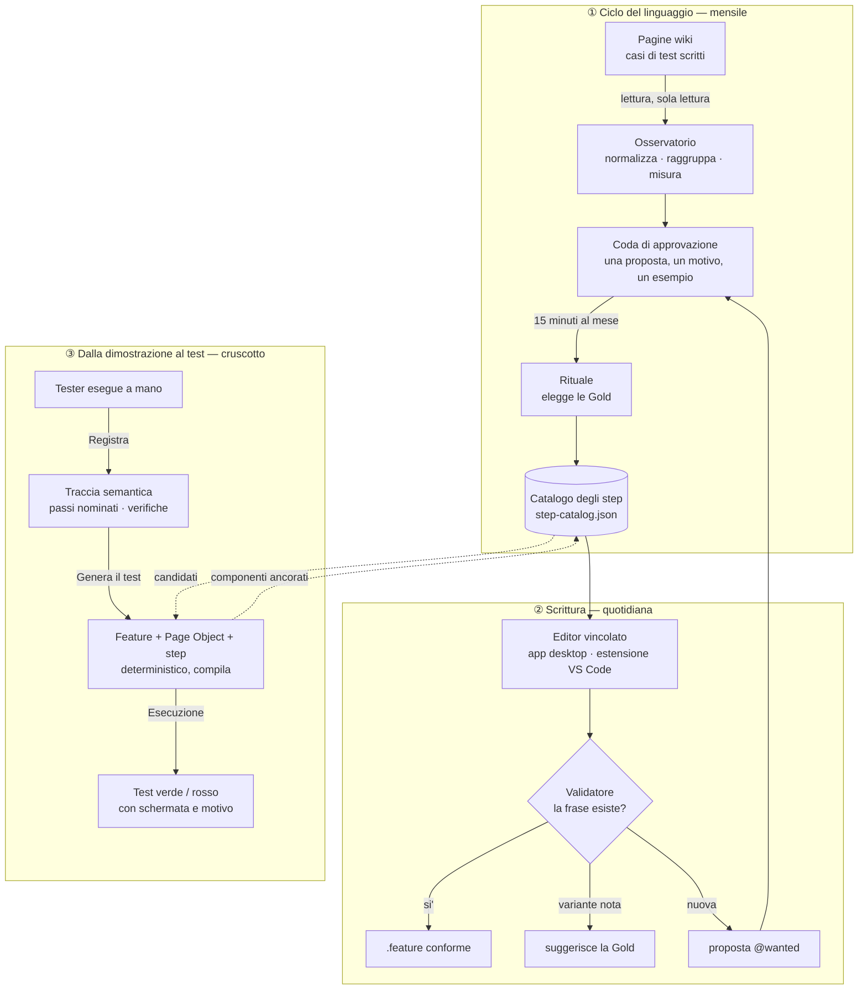
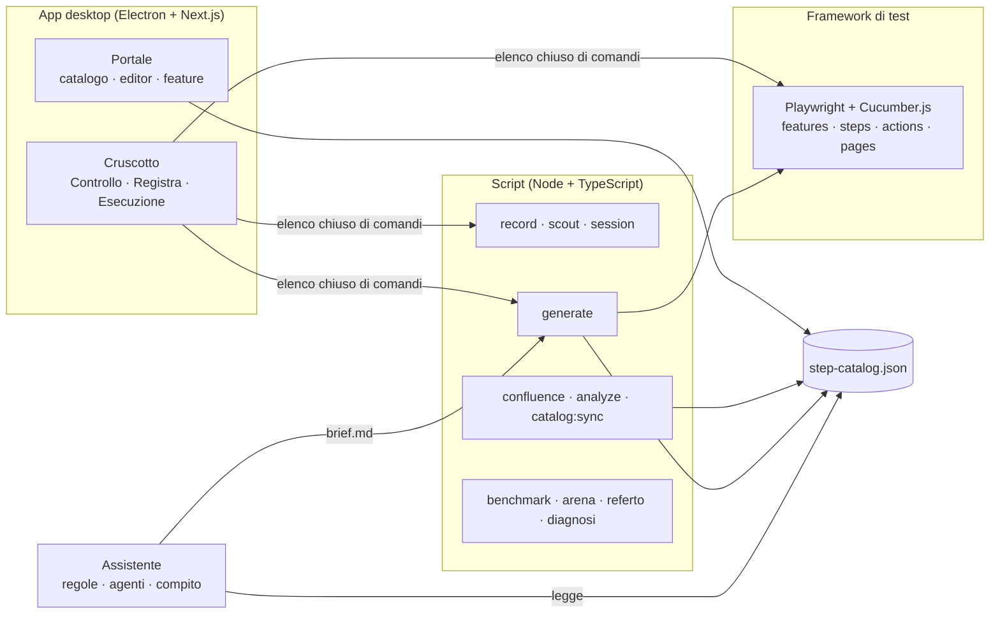

# Panoramica del progetto

> **Il punto di ingresso.** Questo documento racconta il progetto per intero:
> il problema, il metodo, il processo, le componenti, lo stato e cosa manca.
> Il dettaglio e il perche' di ogni scelta stanno nei documenti linkati in fondo
> (§10). Presentazioni, slide e documenti Word si costruiscono **da qui**.
>
> Aggiornato al 2026-09-24, branch `cruscotto-tester`.

---

## 1. In una frase

**Dare ai tester un linguaggio comune per i casi di test, farlo convergere
senza bloccare nessuno, e misurare che converga** — con un'estensione che
trasforma l'esecuzione manuale di un tester in uno scenario e in un test
automatico, senza che il tester debba imparare Gherkin o codice.

---

## 2. Il problema

Tester di aree diverse scrivono casi di test in formato simil-Gherkin dentro
pagine wiki, senza vocabolario condiviso ne' punto di verita' unico. Lo stesso
comportamento viene descritto in N modi diversi, e il costo di riusare supera il
costo di riscrivere.

Misurato sul corpus reale (solo numeri, nessun contenuto):

| Misura | Valore | Come si legge |
|---|---|---|
| Reuse ratio ramo A | **0,72** (569 passi, 409 varianti) | 1,0 = zero riuso |
| Reuse ratio ramo B | **0,85** (279 passi, 238 varianti) | 85 passi su 100 scritti da zero |
| Varieta' assorbita dal clustering | **14%** | non e' parafrasi: e' **assenza di vocabolario** |
| Intenzioni che compaiono una sola volta | **246 su 353** | |
| Copertura con 107 step canonici | **57%** del ramo A | il numero da slide |
| Dove stanno i casi di test | **due rami scollegati** | nessun punto di verita' condiviso |

> *"Non state riusando male un vocabolario. Non ne avete uno."*

---

## 3. Il metodo

Quattro idee, ciascuna con il suo perche' in `docs/anti-entropy/README.md`
(decisioni D1-D32).

1. **Catalogo condiviso come contratto** (D3, D13). Il catalogo degli step
   (`step-catalog.json`) e' la sorgente; l'automazione, quando arriva, ne e' un
   consumatore. Nasce dai gruppi di frasi gia' scritte dai tester, non da un
   disegno a tavolino.
2. **Convergenza a valle, non blocco a monte** (D17, D21). Nessuno aspetta
   un'approvazione per scrivere. Le varianti si registrano e, una volta al mese,
   si elegge la forma canonica (**Gold**) con una matrice a punteggio in chiaro.
   Prezzo dichiarato: l'entropia cresce prima di calare.
3. **Un rituale minuscolo** (D18). Quindici minuti al mese, due o tre persone,
   dentro una riunione che esiste gia'. Le decisioni si prendono in asincrono nei
   tre giorni prima; si scrive solo per dissentire.
4. **Specification by Demonstration** (D9, D10). L'esecuzione manuale di chi
   conosce il business *e'* l'atto di specifica: la si registra come traccia
   semantica (ruolo + nome accessibile, non selettori), e da li' si derivano
   scenario e automazione con le parole del tester.

E un principio che le tiene insieme:

> **L'AI propone, i giudici deterministici decidono** (D6, D23). Validatore del
> catalogo per le frasi, compilatore TypeScript per il codice, dry-run di
> Cucumber per la glue. Nessuna garanzia del sistema dipende da un modello.

---

## 4. Il processo per intero

Tre cicli che condividono un solo oggetto: il catalogo.

### ① Ciclo del linguaggio

| Passo | Strumento | Stato |
|---|---|---|
| Leggere il corpus dalla wiki (sola lettura) | `npm run confluence:discover` / `:probe` / `:fetch` | ✅ verificato sul corpus reale |
| Normalizzare, raggruppare, misurare | `npm run analyze:corpus in=<export>` | ✅ |
| Confrontare col catalogo, preparare coda e report per area | `npm run catalog:sync` | ✅ |
| Eleggere la Gold (matrice a punteggio) | `scripts/lib/gold.ts` | ✅ |
| Pubblicare catalogo e coda accanto agli scenari | `npm run confluence:publish` | ✅ costruito · ⏸ **serve il via libera** (Q9) |
| Registrare le decisioni del rituale | `catalog-apply` | ⬜ **non esiste** |
| Riscrivere le varianti sulla Gold, con anteprima obbligatoria | `catalog-refactor` | ⬜ **non esiste** |

Procedura completa: `docs/anti-entropy/06-rituale.md`.

### ② Scrittura

| Canale | Per chi | Cosa fa |
|---|---|---|
| **App desktop — portale** (`web-ui`, voce "Catalogo passi") | tester senza repo | catalogo cercabile, editor Gherkin con autocomplete vincolato, step sconosciuti sottolineati, proposta `@wanted`, commit su GitHub |
| **Estensione VS Code** (`vscode-extension/`) | tester tecnici | completamento, diagnostica, hover, albero del catalogo |
| **Validatore** (`npm run validate:steps`, hook di pre-commit) | tutti | esatto → ok · simile → suggerisce la forma esistente · nuovo → blocca |
| **Assistente** (Kiro / Amazon Q, regole in `.amazonq/rules/`) | chi scrive con l'AI | cerca prima nel catalogo, propone un solo step nuovo, non scrive senza un si' umano |

### ③ Dalla dimostrazione al test — il cruscotto

Tre schermate dentro l'app desktop, pensate per **un tester manuale da solo,
senza terminale**:

| Schermata | Cosa fa il tester | Cosa succede sotto |
|---|---|---|
| **Controllo** | vede se la macchina e' pronta; configura ambienti, credenziali e accesso con dei pulsanti | diagnosi strutturata (`npm run diagnosi`), scrittura di `bdd-targets.json` e `.env` |
| **Registra** | preme "Registra una sessione", esegue il test a mano, chiude con "Fine intento" ogni passo e usa "Verifica" sui controlli; poi "Genera il test" | `record.ts` produce la traccia; la finestra mostra passi, verifiche e buchi letti dalla traccia; `generate.ts` produce feature, Page Object e step |
| **Esecuzione** | preme "Lancia il test"; puo' guardare il browser o partire senza sessione | Cucumber gira sul bersaglio scelto; i passi diventano verdi o rossi; al fallimento, schermata e indirizzo reale |

L'ambiente su cui si lavora si sceglie **una volta**, nella barra laterale, e
vale per tutta la finestra.

---

## 5. Le componenti

| Componente | Dove vive | Cosa fa | Stato |
|---|---|---|---|
| **Catalogo degli step** | `step-catalog.json`, `STEP_CATALOG.md` | 137 voci (10 implementate, 127 `@wanted`); schema v2 con area, stato, alias, componenti | ✅ contenuto da consolidare |
| **Framework di test** | `src/` | Playwright + Cucumber.js + TypeScript, architettura a layer | ✅ |
| **Osservatorio** | `scripts/confluence-*.ts`, `analyze-corpus.ts`, `lib/normalize.ts`, `lib/cluster.ts` | legge il corpus, misura l'entropia, propone candidati | ✅ |
| **Ciclo del catalogo** | `scripts/catalog-sync.ts`, `lib/gold.ts`, `confluence-publish.ts` | coda, report per area, elezione Gold, pubblicazione | 🟡 mancano apply e refactor |
| **Scout** (dizionario dei componenti) | `scripts/scout.ts`, `lib/inventory.ts`, `lib/stability.ts` | inventaria ruolo + nome di ogni componente, con stabilita' e indice di accessibilita' | ✅ |
| **Recorder** | `scripts/record.ts`, `lib/recorder-overlay.ts`, `lib/labelling.ts` | traccia semantica con passi nominati e verifiche; inventario durante la sessione | ✅ provato sul campo (P1) |
| **Generatore** | `scripts/generate.ts`, `lib/generate-*.ts`, `templates/` | feature + Page Object + step, deterministici; dichiara i buchi | ✅ compila; 5 passi su 11 verdi sul caso reale |
| **Bersagli e sessioni** | `bdd-targets.json`, `.env`, `scripts/session.ts`, `lib/targets.ts` | piu' ambienti, accesso automatico dove si puo', sessione salvata | ✅ |
| **Misure** | `scripts/benchmark.ts`, `benchmark-arena.ts`, `referto.ts` | sette misure per esecuzione; confronto con e senza regole; referto con soli numeri | ✅ costruito · confronto P8 da fare |
| **Assistente** | `.amazonq/rules/` (sorgente) → `.kiro/steering/` (generato), agenti `bdd-generate` e `bdd-authoring` | regole sempre attive sul metodo; agente che scrive e agente che rivede soltanto | ✅ · prove P3/P7 parziali |
| **Cruscotto** | `web-ui/src/app/(cruscotto)/`, `web-ui/src/lib/` | le tre schermate; elenco chiuso di comandi; risultati letti dagli artefatti | ✅ MVP completo |
| **Portale** | `web-ui/src/app/(portale)/` | catalogo, editor, feature, impostazioni | ✅ (giugno), stile allineato al cruscotto |
| **Estensione VS Code** | `vscode-extension/` | completamento, diagnostica, hover, albero | 🟡 non impacchettata |
| **Controlli** | `scripts/lib/*.check.ts` (`npm run check:all`), `web-ui/__tests__` (`vitest`) | 247 asserzioni sugli script, 187 casi sull'app | ✅ |

---

## 6. Chi fa cosa

| Ruolo | Cosa fa | Cosa usa | Cosa **non** deve fare |
|---|---|---|---|
| **Tester manuale** | esegue i test come sempre, nomina i passi, indica le verifiche | cruscotto, portale | scrivere Gherkin o codice, aprire un terminale |
| **Proprietario del consolidamento** | conduce i 15 minuti mensili, ha l'ultima parola sui pareggi | coda, report per area | nominare persone: l'attribuzione e' per area |
| **Tester di un'area, a rotazione** | partecipa al rituale per rappresentare la sua area | coda | — |
| **SDET** | implementa gli step `@wanted`, rivede il codice generato | VS Code, generatore, assistente | generare il corpo degli step alla cieca |
| **Senior / management** | decide se adottare il metodo | report per area, referti | — |

**La sola cosa che la proposta chiede:** un proprietario del consolidamento,
quindici minuti al mese. Senza, il catalogo diventa un raccoglitore di varianti
ben documentato.

---

## 7. Principi che non si toccano

| Principio | Dove si applica |
|---|---|
| Zero costi: nessuna licenza, nessun server | tutto |
| Nessun dato aziendale fuori dalla macchina: `reports/` gitignorato, i referti contengono solo numeri | osservatorio, recorder, referto |
| Credenziali solo in `.env`, mai nei file degli ambienti: al loro posto `${VARIABILE}` | bersagli, cruscotto |
| Una frase per concetto; lo step d'intento batte tre passi di interfaccia | catalogo, assistente |
| Selettori solo nelle Page Object | framework, generatore |
| Nessuna modalita' automatica per il refactor di massa: anteprima e diff obbligatori | rituale |
| Il tester non vede mai un comando dove c'e' un pulsante | cruscotto |
| I risultati si leggono dagli artefatti, mai dalla prosa | cruscotto, misure |

---

## 8. Stato a oggi

**Funziona, provato su un'applicazione vera:**

- misura dell'entropia sul corpus reale (§2);
- registrazione con passi nominati e verifiche (P1: 7 intenti, 12 azioni, 4 verifiche);
- generazione che compila senza AI, e 5 passi su 11 verdi sul caso reale,
  accesso compreso — si ferma su un pulsante ripetuto in cento righe (task 14);
- l'intera catena guidabile dal cruscotto, senza terminale.

**Verifiche:** `tsc`, `check:all` e `rules:check` verdi nella radice; build
dell'app verde; 185 casi su 187 verdi in `web-ui` — i due rossi dipendono dalla
macchina (una registrazione locale gitignorata, e un percorso Windows valutato su
Linux).

**Demo:** i cinque atti sono in `docs/anti-entropy/03-piano-demo.md`; la bozza
della presentazione e' in `docs/anti-entropy/04-presentazione.md`.

---

## 9. Cosa manca

### Da costruire

| # | Cosa | Perche' conta | Riferimento |
|---|---|---|---|
| 1 | **Riga dentro una lista** (ancoraggio a due livelli) | e' dove si ferma oggi il test generato | task 14 |
| 2 | **Applicare le decisioni del rituale e riscrivere le varianti** | senza, il rituale elegge le Gold ma non le fa arrivare negli scenari | `06-rituale.md` passi 4-5 |
| 3 | **Verifiche tipizzate** (valore, comparso, sparito, navigato) | le verifiche oggi sono tutte "la pagina mostra X" | task 7, D16 |
| 4 | **Contenuto del catalogo**: eleggere le prime Gold dal corpus | 127 voci su 137 sono `@wanted`, nessuna ancorata a componenti | `03-piano-demo.md` |
| 5 | Scenario gia' nel repository che non passa il validatore | blocca i commit di chi lo tocca | task 13 |
| 6 | Lockfile di `web-ui` non allineato (`npm ci` fallisce) | un'installazione pulita non parte | — |
| 7 | Due casi di test legati alla macchina di chi li ha scritti | rossi su ogni altra macchina | — |
| 8 | **Le slide** | "da non lasciare per ultimo" | task 10 |

### Decisioni aperte

| # | Domanda | Chi decide |
|---|---|---|
| U1 | Nome del prodotto (oggi "BDD Catalog") | tu |
| U2 | Dove finisce il lavoro del tester: commit, wiki, entrambi | tu |
| U3 | L'eseguibile deve funzionare senza il repository? | tu — se si', l'esecuzione va in Electron e gli script si impacchettano |
| U4 | Lo strumento diventa un prodotto per altri? | tu |
| T3 | Flusso su due domini: supporto nel codice o due registrazioni | chi conosce il flusso |
| T4 | `/questions/N`: identificativo o passo | chi conosce il flusso |
| T11 | Architettura a 3 o 4 layer (`CLAUDE.md` dice 4, il generatore ne produce 3) | chi possiede `CLAUDE.md` |
| Q5 | Chi possiede il rituale | da chiedere in demo |
| Q9 | Pubblicare sulla wiki (scrittura) | chi ha titolo in azienda |
| Q10 | Il remote aziendale e la sua storia | chi ha titolo in azienda |

### Prove sul campo (solo sulla macchina aziendale)

P3 (assistente senza file aperti), P4 (**un collega usa il cruscotto senza
spiegazioni** — la prova del vincolo "alla portata dei tester manuali"), P5
(durata della sessione), P6 (pagine difficili), P7 (agenti nell'IDE), P8
(con e senza regole), P9 (pubblicazione). Protocollo in
`docs/anti-entropy/10-prove-sul-campo.md`.

---

## 10. Mappa dei documenti

| Se vuoi sapere… | Leggi |
|---|---|
| **Tutto, in breve** | questo documento |
| Cosa costruire dopo, in che ordine, cosa **non** costruire | `ROADMAP.md` |
| Fatti, decisioni e domande aperte, con il loro perche' | `docs/anti-entropy/README.md` |
| Le criticita' della proposta iniziale | `docs/anti-entropy/01-analisi-criticita.md` |
| L'architettura del sistema | `docs/anti-entropy/02-design.md` |
| La demo, atto per atto | `docs/anti-entropy/03-piano-demo.md` |
| La presentazione | `docs/anti-entropy/04-presentazione.md` |
| Le fonti | `docs/anti-entropy/05-referenze.md` |
| Il rituale mensile | `docs/anti-entropy/06-rituale.md` |
| L'assistente e come si misura | `docs/anti-entropy/07-assistente.md` |
| Portare tutto su un'altra macchina | `docs/anti-entropy/08-prova-su-altra-macchina.md` |
| Far proseguire il lavoro a Kiro | `docs/anti-entropy/09-lavorare-con-kiro.md` |
| Le prove sul campo e i loro esiti | `docs/anti-entropy/10-prove-sul-campo.md` |
| Requisiti, design e task della catena | `.kiro/specs/demo-anti-entropia/` |
| Il cruscotto: specifica e piano | `docs/superpowers/specs/` e `docs/superpowers/plans/` |
| Usare il cruscotto | `docs/GUIDA-CRUSCOTTO.md` |
| Usare il portale | `docs/USER-GUIDE.md` |
| Scrivere step e scenari | `CONTRIBUTING.md`, `docs/GHERKIN-CONVENTIONS-IT.md`, `docs/STEP-LIFECYCLE.md` |

`.planning/` contiene la pianificazione della prima fase (giugno 2026): e' storia,
non stato corrente.

---

## 11. Cronologia

| Quando | Cosa |
|---|---|
| Giugno 2026 | Scaffold Playwright + Cucumber; app desktop con catalogo ed editor vincolato; import di scenari; estensione VS Code; demo alla manager (M1) |
| 3-8 settembre | Svolta verso l'**anti-entropia**: lettura della wiki, baseline misurata, clustering, scout, recorder, regole per l'assistente, ciclo del catalogo con Gold e alias |
| 9-17 settembre | Generazione deterministica, misure, bersagli multipli; passaggio a Kiro; prime prove sul campo (P1 superata, P2 al primo giro) |
| 21-22 settembre | P2 al quarto giro (5 su 11 verdi); specifica e piano del **cruscotto**, e sua costruzione |
| 23-24 settembre | Cruscotto rifinito dall'uso: due lingue, ambienti configurabili dalla finestra, accesso registrato, componenti ancorati nel catalogo, ambiente scelto una sola volta |
